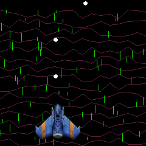
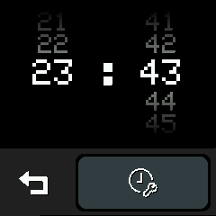
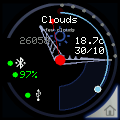
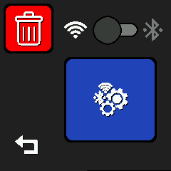

[](https://github.com/lunokjod/watch/actions/) 


# LilyGo TWatch 2020 lunokIoTWatch firmware

[Buy me a coffe!](https://www.buymeacoffee.com/lunokjod)


## **Last videos from development**

### Video test:
"CAN *YOUR* SMARTWATCH RICKROLL?" * Shinoa Fores


### 3D engine:


### IA driven freehand character recognition (can learn your own patterns):


       

* Note: under heavy development (not ready for everyday use)


* Supported devices:
 * lilyGo TWatch 2020 series v1
 * lilyGo TWatch 2020 series v2
 * lilyGo TWatch 2020 series v3 (both battery and UART/TTL) 380mAh and 500mAh (planned 400mAh version)


* You can set WiFi credentials ("Home>Settings>Prov") via QR using:
  * Android device: https://play.google.com/store/apps/details?id=com.espressif.provsoftap (select WiFi provisioning using WiFi)
  * Apple iOS: https://apps.apple.com/us/app/esp-softap-provisioning/id1474040630

* The BluetoothLE pairing can be archieved via "Home>Settings>Pair" can use BatON https://play.google.com/store/apps/details?id=com.limi.baton on Android to remote battery monitoring

* Can use Gadgetbridge https://www.gadgetbridge.org/ and receive android notifications on watch (use "BANGLEJS esprunio" as device)


## Build, upload & flash:
 * First take care about what hardware version have (at this time 1,2 and 3)
 * Install https://platformio.org/install/cli

### Don't bother me, give me fast:
```
$ git clone https://github.com/lunokjod/watch.git
$ cd watch
$ touch openWeatherKey.txt
$ pio run -e Release-twatch2020_V3 -t upload
$ pio run -e Release-twatch2020_V3 -t uploadfs
```
 * Replace '_V3' with your watch version

## Update from earlier version:
```
$ git fetch
$ git reset --hard HEAD
$ git merge '@{u}'
$ pio run -t clean
$ pio run -e Release-twatch2020_V3 -t upload
$ pio run -e Release-twatch2020_V3 -t uploadfs
```
 * Replace '_V3' with your watch version

## Basic usage:

* Use button to wake/sleep the watch
* When screen goes on, the watchface appears
* Long button push for poweroff

## What does:
* WiFi time sync once every 24h (using network time protocol NTP)
* WiFi weather sync every 30 minutes, needs online account (set your openWeather key in "openWeatherKey.txt" at same level as platformio.ini before build) more info: https://openweathermap.org/
* Wake up every 15 minutes to monitor the user pose (future sleep monitor)
* Wake up every activity (steps monitor app Home>Steps)
 * BLE GATT support
  * Pairing with random pin (see "Home>Settings>Pair" on main menu)
   * Remove current bonded devices
  * BLE Battery standard notification. Can use BatON https://play.google.com/store/apps/details?id=com.limi.baton on Android to remote battery monitoring
  * Man in the middle resistant (BLE)
 * Color themes
 * Multiple watchfaces (call for designers!)
 * Screen orientation
 * OTA update (wireless)
 * Gadgetbridge compatibility (BangleJS-esprunio) for android/iOS notifications
 * Media player
 * Handwritting trainable keyboard
 * BLE zone location
 * omdb Posters api
 * Launch lamp on gesture (put your arms down and double tap or PEK)
 * Deep sleep: Put your watch with the screen ON facing to plane surface and the stripes points up
 * Wakeup: Simply wear-it on your wrist, the watch boots up, PEK and doubleTap already works
 * Lua scripting
 * UI rich controls with layouting via (LuI)
 * 3D engine control on LuI
 * Handwritting reconeisance

## Full application list:

**OUTDATED**

[See outdated app gallery](src/app/README.md)

## Hardware support:
 * BMA423 support (including during sleep)
 * AXP202 support (including sleep)
 * haptic and vibration support
 * ST7789V support (lilygo TFT_eSPI)
 * Partial RTC support (system sync)
 * MAX98357A (mp3 playback support)
 * WiFi (via provisioning)
 * BLE (work in progress) issues while wifi is in use
 * IR work, but only can send with this hardware (useless by now, I want to do jokes!)

### Pending to implement:
* Multiple apps (seamless)
* Add first launch application assistant to set or omit the desired setup parts
* PDM Mic (voice assistant)
* RTC (alarm features)
* espNow (locate other family watches, icon chat availiable)
* Custom activities (hidden app availiable for testing)
* feedbacked apps (what do you need?)
* Web installer: https://espressif.github.io/esptool-js/
 * User customizable night hours, during this time, the system don't allow to reply anything inmediatly(delayed send guarantees don't send stupid messages to others by accident)
 * Menú must remember the last used or better: reorder the list with user preferences (app usage counters)
 * hive mode (wireless mesh, share info with other lunokIoT, without infrastructure)
## Important build flags
 platform.ini file contains the build flags, the more relevant are:
 * **-DLILYGO_WATCH_2020_V3** change with your version (lilygo library driven) please report issues :)
* **-DLOG_LOCAL_LEVEL=ESP_LOG_VERBOSE** esp-idf debug shit
* **-DLUNOKIOT_DEBUG** generic system debug messages
* **-DLUNOKIOT_DEBUG_APPLICATION** allow use of lAppLog()
* **-DLUNOKIOT_DEBUG_EVENTS** System events specific debug messages
* **-DLUNOKIOT_DEBUG_UI** UI specific debug messages
* **-DLUNOKIOT_DEBUG_NETWORK** Network specific debug messages
* **-DLUNOKIOT_SILENT_BOOT** dont shake and no fanfare sound when start/stop
* **-DLUNOKIOT_WIFI_ENABLED** start the wifi timed connection subsystem
  * **-DLUNOKIOT_UPDATES_ENABLED** check lastbuild on github and warn about the update
* **-DLUNOKIOT_BLE_ENABLED** start the ble subsystem
* **-DLUNOKIOT_SCREENSHOOT_ENABLED** Allow to do screenshoots (touch 5 seconds to use it)
* **-DLUNOKIOT_SERIAL** Enable serial comms via UART 115200bps (output log)
* **-DLUNOKIOT_DEBUG_UI_DEMO** Enable a bunch of demo applications about graphics
## Common problems:
### Build failed: "NO WEATHER KEY FILE FOUND, ABORT BUILD"
 * If you don't have a openweather account get it one and generate a user key
 * Put the key on "openWeatherKey.txt" (yes, camelCase)
 * Try to build again
### Clock don't show nothing on screen
 * is a V3 device?
 * Review the build list of platformio and select RELEASE and your version V_1,V_2,V_3...

## Know problems
 * Touch are unstable meanwhile calibration is running (some seconds after boot)

## Warning:

**Advice about usability:** This software is under heavy development and erlier development phase... many parts can be disfunctional, broken or buggy

**Advise about privacy:** This software (as device does) can monitor your activities (for fitness applications purposes) and isn't shared outside

**Advise about warranty:** Absolutely no warrant about nothing, use at your own risk

## Contact us: https://t.me/lunowatch

**Crazy long term ideas:**
 * https://github.com/espressif/esp-launchpad
 * https://github.com/espressif/esp-sr/blob/master/esp-tts/README_en.md
 * https://github.com/espressif/esp-sr
 * https://github.com/niicoooo/esp32-elfloader/tree/master/example-payload
