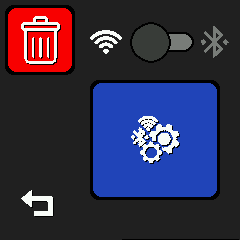
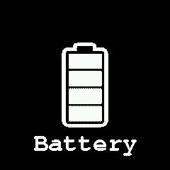

# Applications list:

## Set Date/Time
 * this app allow set time/date

## Provisioning
 * this app allow connect watch to internet via privisioning with a official ESP32 provisionning app from espressif
   * Android: https://play.google.com/store/apps/details?id=com.espressif.provsoftap 
 * Notes: at this time, only WiFi provisioning is availiable

## Screen orientation
 * Rotate whole screen

## Battery
 * Show battery health

* @TODO 