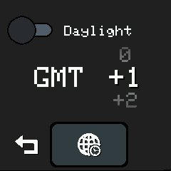
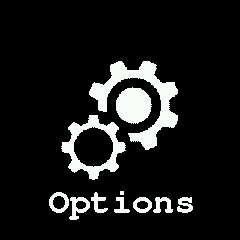
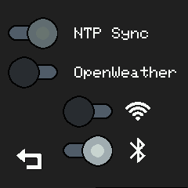
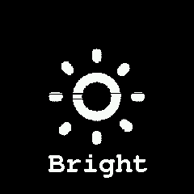
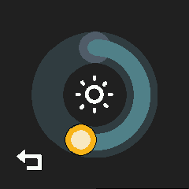
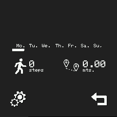
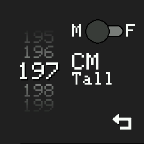

# Applications list:

## Set Date/Time
 * this app allow set time/date


## Timezone
 * this app allow set system timezone




## Provisioning
 * this app allow connect watch to internet via privisioning with a official ESP32 provisionning app from espressif
   * Android: https://play.google.com/store/apps/details?id=com.espressif.provsoftap 
 * Notes: at this time, only WiFi provisioning is availiable


## Screen orientation
 * Rotate whole screen


## Battery
 * Show battery health


## Settings
 * Enable disable features




## Brightness
 * Set default screen brightness





## Steps
 * Week activity stats 





* @TODO 

# Develop new application:

 * Duplicate files named:
 ```src/app/ApplicationBase.hpp``` & ```src/app/ApplicationBase.cpp``` set name at your discretion (recomended add "Appliction" at end)

 * Edit both files and change all references to "ApplicationBase" and change to "YourDesiredNameApplication"

 * your app is ready!
 
 ## Add to mainmenu (edit app/MainMenu.cpp)

 Include here #include "SomethingApplication.hpp" file on it

On the AllApps definition goes all MainMenu entries:

```{"PUT YOUR APP NAME HERE",img_mainmenu_bright_bits, img_mainmenu_bright_height, img_mainmenu_bright_width, []() { LaunchApplication(new MYAPPLICATION()); } },```

and it's all... icons can be made with gimp (xbm format) img_mainmenu_bright_bits,img_mainmenu_bright_height and img_mainmenu_bright_width are inside xbm file

## How application works:

 * Applications on lWatch are objects descendants from TemplateApplication or LunokIoTApplication

 ***LunokIoTApplication*** is the base application (use it if don't want "back" button on your application)

 ***TemplateApplication*** is a LunokIoTApplication with back button (recommended)
